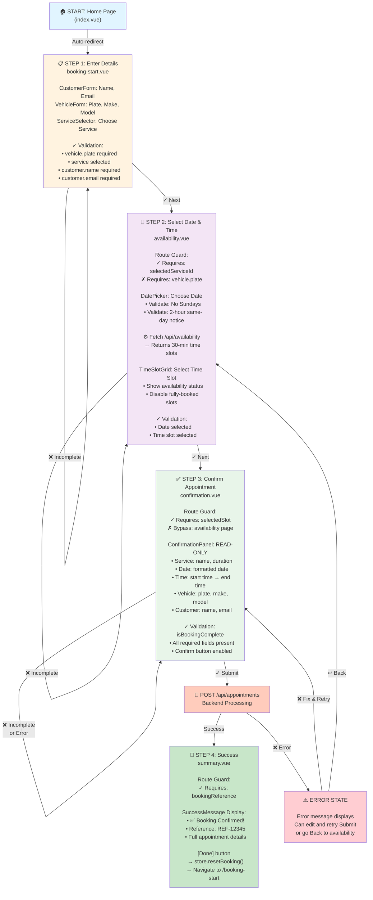

# Frontend Architecture Documentation

## Overview

The **Universal Scheduler** is a Nuxt 4 application with two main areas:

1. **Customer booking flow** — four-step authenticated appointment booking (vehicle/service → availability → confirmation → summary), backed by Nitro BFF proxies to the .NET API.
2. **Admin integration** — JWT auth and CRUD for dealerships, skills, service types, bays, technicians, customers, and vehicles via a Nitro BFF proxy to the .NET API.

Design and progress: [docs/FRONTEND_INTEGRATION_PLAN.md](docs/FRONTEND_INTEGRATION_PLAN.md) | [docs/FRONTEND_INTEGRATION_TRACKER.md](docs/FRONTEND_INTEGRATION_TRACKER.md)

The customer flow follows a **Pinia-Centric Sequential Flow** pattern. The admin area uses permission-gated routes, shared form components, and centralized API error handling.

---

## Admin & Authentication Architecture

### BFF proxy pattern

The browser calls relative `/api/*` on Nuxt. Auth, admin, booking, and me Nitro routes forward to the .NET backend (`NUXT_API_BASE_URL`). The JWT is stored in an httpOnly cookie; the client never calls .NET directly.

```
Browser → Nuxt Nitro (/api/auth/*, /api/admin/*, /api/booking/*, /api/me/*) → .NET API
```

### Auth flow

| Step | Detail |
|------|--------|
| Login | `POST /api/auth/login` → Nitro sets httpOnly cookie + returns metadata |
| Session | `authStore` holds `email`, `role`, `permissions`, `expiresAt` from `/api/auth/me` |
| Guards | `auth` middleware (cookie / `isAuthenticated`); `admin` middleware (`dealerships:read` or `customers:read`) |
| 401 | `useAdminApi` / `useBookingApi` / `authStore` logout + redirect `/login` |
| 403 | Snackbar in admin layout + `/forbidden` page for route-level denial |

### Admin CRUD layer

| Layer | Files |
|-------|-------|
| Types | `app/types/api/` — GUID-based DTOs mirroring .NET |
| Client | `app/composables/useAdminApi.ts` — calls `/api/admin/*` |
| BFF | `server/api/admin/**` — forwards `Authorization` via `authenticatedBackendFetch` |
| UI | `app/pages/admin/**`, `app/components/admin/*` |
| Errors | `app/utils/apiErrors.ts`, `app/composables/useAppNotification.ts` |

### Permission-gated navigation

| Nav item | Permission |
|----------|------------|
| Dealerships | `dealerships:read` |
| Skills | `skills:read` |
| Customers | `customers:read` (Admin + Staff) |

Nested resources (service types, bays, technicians, vehicles) are linked from parent list rows.

---

## Customer Booking Architecture

The application guides customers through a four-step booking process: entering customer/vehicle details → selecting a date and time slot → confirming the appointment → viewing the booking confirmation.

- **All booking state** is centralized in a single Pinia store (`bookingStore`)
- **Pages act as route handlers** with validation gates that enforce prerequisite steps
- **Components are reusable UI** with no local booking state (always synced to store)
- **Composables handle API logic** and caching; store actions orchestrate the overall flow

This architecture prevents users from skipping steps and ensures a consistent, predictable booking experience.

---

## Frontend Architecture

### 1. State Management Layer

**Single Source of Truth: `bookingStore`**

All booking workflow state lives in `app/stores/bookingStore.ts` using Pinia (Vue's state management library). This eliminates prop drilling and ensures every component sees the same booking data.

#### State Structure

| State Property | Type | Purpose |
|---|---|---|
| `services` | `Service[]` | Array of available services |
| `selectedServiceId` | `string` | Currently selected service ID |
| `selectedDate` | `string` | Selected booking date (YYYY-MM-DD) |
| `availableSlots` | `Slot[]` | Time slots available for selected date/service |
| `selectedSlot` | `Slot \| null` | Currently selected time slot |
| `vehicle` | `{ plate, make?, model? }` | Vehicle information |
| `customer` | `{ name, email }` | Customer contact information |
| `appointmentId` | `string \| null` | Appointment ID after booking |
| `bookingReference` | `string \| null` | Reference number (e.g., "REF-12345") |
| `confirmation` | `Appointment \| null` | Full appointment object after successful booking |
| `isLoading` | `boolean` | Loading state for API calls |
| `error` | `string \| null` | Error message if operation failed |

#### Computed Getters

```typescript
selectedService: Service | undefined
// Returns the full service object for the selected serviceId

isBookingComplete: boolean
// Returns true if ALL required fields are filled:
// vehicle.plate && selectedServiceId && selectedDate && selectedSlot && customer.name && customer.email
```

#### Store Actions

| Action | Purpose |
|---|---|
| `loadServices()` | Fetch service catalog from backend |
| `selectService(id)` | Set service and reset dependent fields (date, slots, slot selection) |
| `selectDate(date)` | Set booking date and clear slot selection |
| `fetchAvailability(date)` | Fetch available time slots from backend for selected service + date |
| `selectSlot(slot)` | Set the selected time slot |
| `setVehicle(plate, make?, model?)` | Update vehicle information |
| `setCustomer(name, email)` | Update customer information |
| `submitBooking()` | Create appointment via API (requires `isBookingComplete === true`) |
| `resetBooking()` | Clear entire state (used after successful booking or on new journey) |

**Key Design Point:** When `selectService()` is called, it resets `selectedDate`, `availableSlots`, and `selectedSlot` to prevent stale data. Similarly, changing the date clears the slot selection. This cascading reset ensures the UI stays consistent.

---

### 2. Component Hierarchy

The application uses a hierarchical component structure organized by pages. Each page imports specific child components that handle UI rendering while the store handles all state.

```
┌─ app.vue (Root)
│
├─ app/pages/
│  │
│  ├─ index.vue
│  │  └─ Entry point (redirects to /booking-start)
│  │
│  ├─ booking-start.vue
│  │  ├─ CustomerForm
│  │  │  └─ Input form for name, email
│  │  ├─ VehicleForm
│  │  │  └─ Input form for plate, make, model
│  │  └─ ServiceSelector
│  │     └─ Displays services list, allows selection
│  │
│  ├─ availability.vue
│  │  ├─ DatePicker
│  │  │  └─ Calendar widget for date selection
│  │  └─ TimeSlotGrid
│  │     └─ Displays available/unavailable time slots
│  │
│  ├─ confirmation.vue
│  │  └─ ConfirmationPanel
│  │     └─ Read-only summary of all booking details
│  │
│  └─ summary.vue
│     └─ SuccessMessage
│        └─ Booking confirmation with reference number
```

#### Component Responsibilities

| Component | Props/Inputs | Outputs | State Management |
|---|---|---|---|
| **CustomerForm** | - | Emits customer data | No local state; calls `store.setCustomer()` |
| **VehicleForm** | - | Emits vehicle data | No local state; calls `store.setVehicle()` |
| **ServiceSelector** | `services`, `selectedId` | Emits service selection | No local state; calls `store.selectService()` |
| **DatePicker** | `selectedDate` | Emits selected date | Local calendar state only; calls `store.fetchAvailability()` |
| **TimeSlotGrid** | `slots`, `selectedSlot`, `loading` | Emits slot selection | No local state; calls `store.selectSlot()` |
| **ConfirmationPanel** | `slot`, `service`, `date`, `vehicle`, `customer` | None (read-only) | No local state; displays store data |
| **SuccessMessage** | `bookingReference`, `appointment` | Emits reset action | No local state; displays store data |

**Design Pattern:** Components are **presentation layers only**. They receive data as props (from store) and emit user actions to the store. No component holds booking data locally. The `DatePicker` is a minor exception—it maintains local calendar UI state but delegates all booking operations to store.

---

### 3. Composables & API Layer

Composables are reusable Composition API functions that encapsulate API logic, caching, and side effects. They are called from store actions, not directly from components.

#### Composables Reference

| Composable | Location | Purpose | Called By |
|---|---|---|---|
| **useApiClient** | `app/composables/useApiClient.ts` | Typed API wrapper with methods: `fetchServices()`, `fetchAvailability()`, `createAppointment()` | Internally by other composables |
| **useServices** | `app/composables/useServices.ts` | Fetch and cache service catalog; prevents re-fetching on repeated calls | `bookingStore.loadServices()` |
| **useAvailability** | `app/composables/useAvailability.ts` | Fetch and cache time slots for a service/date; handles loading/error states | `bookingStore.fetchAvailability()` |
| **useDateValidation** | `app/composables/useDateValidation.ts` | Validate booking dates (no Sundays, must be 2+ hours in future for same-day bookings) | `DatePicker` component |

#### API Integration Flow

```
Component (e.g., DatePicker)
    ↓ (user selects date)
    ↓ Calls store.fetchAvailability(date)
    ↓
Store Action
    ↓ Calls useAvailability().fetch(serviceId, date)
    ↓
Composable (useAvailability)
    ↓ Calls useApiClient.fetchAvailability()
    ↓
API Client (useApiClient)
    ↓ Makes $fetch request to /api/availability
    ↓
Backend API
    ↓ Returns time slots
    ↓
Response propagates back up → Store updates state → Components re-render
```

---

## Appointment Booking Flow

### User Journey: 4 Steps

Users proceed sequentially through four steps, with validation gates enforcing prerequisites. The following mermaid diagram visualizes the complete flow:



### Step-by-Step Description

#### **STEP 1: Customer & Vehicle Information (`/booking-start`)**

**Components Involved:**
- `CustomerForm` — Input fields for name, email
- `VehicleForm` — Input fields for plate, make, model
- `ServiceSelector` — Dropdown/list of services

**User Actions:**
1. Enter name and email → `store.setCustomer(name, email)`
2. Enter vehicle plate, make, model → `store.setVehicle(plate, make, model)`
3. Select a service → `store.selectService(serviceId)`

**State Changes:**
- `customer.name` = entered name
- `customer.email` = entered email
- `vehicle.plate` = entered plate
- `selectedServiceId` = service ID
- When service changes: `selectedDate`, `availableSlots`, `selectedSlot` are reset to empty

**Validation Gate:**
- "Next" button enabled when: `vehicle.plate && selectedServiceId && customer.name && customer.email`
- Next button navigates to `/availability`

---

#### **STEP 2: Date & Time Selection (`/availability`)**

**Route Guard (on page mount):**
```typescript
if (!store.selectedServiceId || !store.vehicle.plate) {
  navigateTo('/booking-start'); // Redirect if prerequisites missing
}
```
This prevents users from accessing `/availability` without completing step 1.

**Components Involved:**
- `DatePicker` — Calendar widget with date validation
- `TimeSlotGrid` — Display of available/unavailable slots

**User Actions:**
1. Select a date from calendar → `store.fetchAvailability(date)`
   - Calls `/api/availability?serviceId={id}&date={date}`
   - Backend returns array of 30-minute time slots
   - Store updates `availableSlots`

2. Select a time slot → `store.selectSlot(slot)`

**State Changes:**
- `selectedDate` = selected date (YYYY-MM-DD)
- `availableSlots` = array of slots from API
- `selectedSlot` = chosen slot object

**Validation Gate:**
- "Next" button enabled when: `selectedDate && selectedSlot`
- Next button navigates to `/confirmation`

**Date Validation:**
- No Sunday dates allowed (weekend blackout)
- Same-day bookings must be 2+ hours in future
- Validation enforced by `useDateValidation()` composable

---

#### **STEP 3: Review & Confirm (`/confirmation`)**

**Route Guard (on page mount):**
```typescript
if (!store.selectedSlot) {
  navigateTo('/availability'); // Redirect if no slot selected
}
```
This prevents users from confirming without selecting a time slot.

**Components Involved:**
- `ConfirmationPanel` — Read-only summary display (no forms)

**Display Contents (all from store):**
- Service name + duration
- Selected date (formatted)
- Time (start → end)
- Vehicle details (plate, make, model)
- Customer details (name, email)

**User Actions:**
1. Review all details (read-only display)
2. Click "Confirm Booking" → `store.submitBooking()`
   - Validates `isBookingComplete === true`
   - Calls `/api/appointments` (POST) with all booking data
   - Backend creates appointment, returns `appointmentId` + `bookingReference`
   - Store updates `bookingReference` and `confirmation`
   - Navigation to `/summary` triggered

**State Changes:**
- `isLoading` = true during submission
- After success:
  - `bookingReference` = returned reference (e.g., "REF-12345")
  - `appointmentId` = returned ID
  - `confirmation` = full appointment object

**Validation Gate:**
- "Confirm Booking" button enabled when: `isBookingComplete === true && !isLoading`
- Disabled during submission (shows "Booking..." text)
- If error occurs: error message displays, user can fix & retry

---

#### **STEP 4: Booking Confirmation (`/summary`)**

**Route Guard (on page mount):**
```typescript
if (!store.bookingReference) {
  navigateTo('/confirmation'); // Redirect if no booking confirmed
}
```
This prevents users from viewing the success page without a successful booking.

**Components Involved:**
- `SuccessMessage` — Displays confirmation details

**Display Contents:**
- ✅ "Booking Confirmed" message
- Booking reference number (e.g., "REF-12345")
- Full appointment details (service, date, time, vehicle, customer)

**User Actions:**
1. Review successful booking (read-only)
2. Click "Done" button → `store.resetBooking()` → Navigate to `/booking-start`
   - Clears all state to allow new booking

---

## Routing & Validation Gates

The application enforces **strict sequential flow** through route guards on pages and computed validation checks.

### Route Protection Model

Each page checks prerequisites on `onMounted()`. If prerequisites are missing, user is redirected to the appropriate earlier step:

| Page | Route | Route Guard Check | Redirect If Failed |
|---|---|---|---|
| **index.vue** | `/` | None | Auto-redirect to `/booking-start` |
| **booking-start.vue** | `/booking-start` | None (entry point) | - |
| **availability.vue** | `/availability` | `selectedServiceId && vehicle.plate` | → `/booking-start` |
| **confirmation.vue** | `/confirmation` | `selectedSlot` | → `/availability` |
| **summary.vue** | `/summary` | `bookingReference` | → `/confirmation` |

### Validation Computation

The computed getter `isBookingComplete` validates that all required fields are populated:

```typescript
isBookingComplete = Boolean(
  vehicle.plate &&
  selectedServiceId &&
  selectedDate &&
  selectedSlot &&
  customer.name &&
  customer.email
);
```

This getter is used to:
- Disable "Next" buttons if validation fails
- Disable "Confirm Booking" button in confirmation step
- Validate in `submitBooking()` before API call

### User Navigation Flow

- **Forward Navigation:** Each step has a "Next" button that checks validation before navigating to the next page
- **Backward Navigation:** Each step has a "Back" button that navigates to the previous step (no validation check)
- **Error Handling:** If booking submission fails, error message displays and user remains on confirmation page; can edit and retry

---

## Data Types & API Endpoints

### TypeScript Types

All types are defined in `server/utils/types.ts` and imported using `#server/utils/types`:

```typescript
interface Service {
  id: string;
  name: string;
  durationMinutes: number;
  requiredSkill: string;
}

interface Slot {
  startTime: number;        // Unix milliseconds
  endTime: number;          // Unix milliseconds
  available: boolean;
  technicianId?: string;
  bayId?: string;
}

interface Appointment {
  id: string;
  serviceId: string;
  startTime: number;        // Unix milliseconds
  endTime: number;          // Unix milliseconds
  vehiclePlate: string;
  vehicleMake?: string;
  vehicleModel?: string;
  customerName: string;
  customerEmail: string;
  bookingReference: string;
  technicianId?: string;
  bayId?: string;
}
```

### API Endpoints

#### **GET /api/services**

Fetch all available services.

**Response:**
```typescript
{
  services: Service[]
}
```

**Called by:** `bookingStore.loadServices()` on page `/booking-start` mount

---

#### **GET /api/availability**

Fetch available time slots for a service on a specific date.

**Query Parameters:**
| Param | Type | Example |
|---|---|---|
| `serviceId` | string | "1" |
| `date` | string | "2025-05-15" (YYYY-MM-DD) |

**Response:**
```typescript
{
  slots: Slot[]
}
```

**Slot Generation Logic (Backend):**
- Generates 30-minute intervals within operating hours (8:00–18:00)
- Calls `isSlotAvailable(serviceId, startTime, endTime)` to check conflicts (existing appointments, technician availability, bay availability)
- Excludes slots where end time is > service duration from closing (prevents booking if insufficient time to complete)
- Returns array with `available: true/false` for each slot

**Called by:** `bookingStore.fetchAvailability(date)` when user selects a date on `/availability`

---

#### **POST /api/appointments**

Create a new appointment (booking confirmation).

**Request Body:**
```typescript
{
  serviceId: string;
  startTime: number;              // Unix milliseconds
  endTime: number;                // Unix milliseconds
  vehiclePlate: string;
  vehicleMake?: string;
  vehicleModel?: string;
  customerName: string;
  customerEmail: string;
}
```

**Response:**
```typescript
{
  appointmentId: string;          // e.g., "APT-67890"
  bookingReference: string;       // e.g., "REF-12345"
  appointment: Appointment;       // Full appointment object
}
```

**Backend Logic:**
1. Validates all required fields present
2. Calls `isSlotAvailable(serviceId, startTime, endTime)` again (race condition check)
3. If slot unavailable → Returns 400 error "Slot no longer available"
4. Generates unique `appointmentId` and `bookingReference`
5. Calls `storeAppointment(appointment)` to save (currently in-memory; would be database in production)
6. Assigns technician & bay based on skill matching and availability
7. Returns appointment details to frontend

**Called by:** `bookingStore.submitBooking()` when user clicks "Confirm Booking" on `/confirmation`

---

#### **GET /api/appointments**

Fetch all appointments (for admin viewing; not used in customer flow).

**Response:**
```typescript
{
  appointments: Appointment[]
}
```

---

## Example Walkthrough: Successful Booking

This walkthrough shows the complete state progression through a successful booking:

### Initial State
```typescript
bookingStore = {
  services: [],
  selectedServiceId: '',
  selectedDate: '',
  availableSlots: [],
  selectedSlot: null,
  vehicle: { plate: '', make: '', model: '' },
  customer: { name: '', email: '' },
  appointmentId: null,
  bookingReference: null,
  confirmation: null,
  isLoading: false,
  error: null,
}
```

### After STEP 1: Customer & Service Selected
```typescript
bookingStore = {
  ...
  selectedServiceId: '1',                    // User selected "Oil Change"
  vehicle: { plate: 'ABC123', make: 'Honda', model: 'Civic' },
  customer: { name: 'John Doe', email: 'john@example.com' },
  ...
}

computed: {
  selectedService: { id: '1', name: 'Oil Change', durationMinutes: 30, requiredSkill: 'basic' }
  isBookingComplete: false                   // Still missing date + slot
}
```

### After STEP 2: Date & Time Selected
```typescript
bookingStore = {
  ...
  selectedDate: '2025-05-15',                // User selected May 15, 2025
  availableSlots: [
    { startTime: 1715784000000, endTime: 1715785800000, available: true },    // 08:00–08:30
    { startTime: 1715785800000, endTime: 1715787600000, available: false },   // 08:30–09:00 (booked)
    { startTime: 1715787600000, endTime: 1715789400000, available: true },    // 09:00–09:30
    ...
  ],
  selectedSlot: { startTime: 1715787600000, endTime: 1715789400000, available: true },  // User selected 09:00–09:30
  ...
}

computed: {
  isBookingComplete: true                    // All required fields now filled
}
```

### After STEP 3: Booking Submitted
```
User clicks "Confirm Booking"
  → store.submitBooking()
  → store.isLoading = true
  → API: POST /api/appointments with all booking data
    
Backend Response:
{
  appointmentId: 'APT-98765',
  bookingReference: 'REF-54321',
  appointment: {
    id: 'APT-98765',
    serviceId: '1',
    startTime: 1715787600000,
    endTime: 1715789400000,
    vehiclePlate: 'ABC123',
    vehicleMake: 'Honda',
    vehicleModel: 'Civic',
    customerName: 'John Doe',
    customerEmail: 'john@example.com',
    bookingReference: 'REF-54321',
    technicianId: 'TECH-001',
    bayId: 'BAY-02'
  }
}

bookingStore after response = {
  ...
  appointmentId: 'APT-98765',
  bookingReference: 'REF-54321',
  confirmation: { ...full appointment object... },
  isLoading: false,
  ...
  → Auto-navigate to /summary
}
```

### STEP 4: Success Page
```typescript
bookingStore = {
  ...
  bookingReference: 'REF-54321',
  confirmation: { ...full appointment object... },
  ...
}

User sees:
✅ Booking Confirmed!
Reference: REF-54321
Service: Oil Change (30 min)
Date: May 15, 2025
Time: 9:00 AM – 9:30 AM
Vehicle: Honda Civic (ABC123)
Customer: John Doe (john@example.com)

[Done button clicked]
  → store.resetBooking()           // Clear all state
  → navigateTo('/booking-start')   // Start new booking
  
bookingStore reset to initial empty state
```

---

## Architecture Patterns & Best Practices

### 1. **Single Source of Truth (Pinia Store)**
All booking data is centralized in `bookingStore`. Components read from store, emit actions to store. This prevents inconsistency and reduces bugs from data duplication.

### 2. **Route Guards Enforce Prerequisites**
Each page has an `onMounted` guard checking that required state exists. Users cannot skip steps or circumvent the flow by URL manipulation.

### 3. **Computed Validation**
The `isBookingComplete` computed getter is reused in multiple places (button disabled state, submission validation) ensuring consistent validation logic.

### 4. **Cascading State Resets**
When a user changes a service, all dependent fields (date, slots, slot selection) are cleared. This prevents stale data and UI confusion.

### 5. **Composables for API Logic**
API calls, caching, and error handling are abstracted into composables. The store orchestrates the flow but delegates API concerns to composables.

### 6. **Component Purity**
Components receive data as props from store and emit user actions as function calls. They never hold booking state, making them reusable and testable.

---

## Development Guidelines

When working on this application:

1. **Adding new booking fields?** Add to `bookingStore.ts` state + getters (if needed) + actions. Update `isBookingComplete` if it's a required field.

2. **Creating new API endpoint?** Create a new composable in `app/composables/` that wraps the API call, and call it from a store action.

3. **Adding validation rules?** Create/update validation functions in `app/utils/` or `useDateValidation.ts`.

4. **Modifying the booking flow?** Update the route guard checks in `onMounted()` of affected pages.

5. **Testing the flow?** Use the integration test in `test/bookingFlow.integration.spec.ts` as a reference. Run `npm test` to verify.

---

**Last Updated:** July 6, 2026  
**Architecture Version:** 1.1  
**Related Files:** [AGENTS.md](AGENTS.md) | [STORES.md](STORES.md) | [docs/FRONTEND_INTEGRATION_PLAN.md](docs/FRONTEND_INTEGRATION_PLAN.md)
