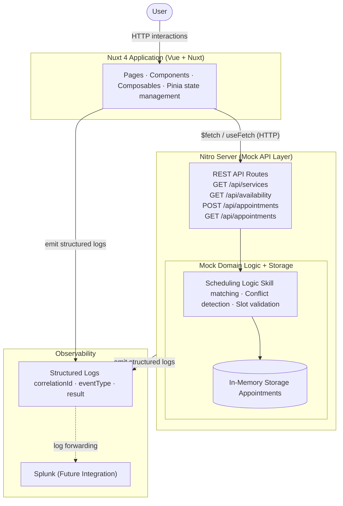

# Overview

**Scenario A: The Unified Service Scheduler** focuses on replacing manual dealership service booking with a digital appointment scheduling experience. The application allows a user to request a service appointment for a specific vehicle, service type, and dealership at a desired time, while ensuring the appointment can only be confirmed if both a qualified technician and a service bay are available for the full service duration.

The solution aims to address the following business and user problems:
- Customers and dealership staff need a faster alternative to manual phone or email booking.
- A booking should only be confirmed when all required resources are available for the full duration of the selected service.
- The system should reduce booking mistakes by surfacing valid appointment options instead of relying on manual coordination.

In practical terms, the Frontend application must guide the user through selecting a vehicle, service type, and desired date, then present only valid appointment slots based on Backend availability checks. Once a slot is selected, the system should capture customer details and create a confirmed appointment record.

For this challenge, only the Frontend is implemented with the desired requirements, while the Backend served as a mock with basic operations.

# Assumptions

The following assumptions define the scope clearly and keep the implementation realistic and achievable.
## Business Assumptions
- The implementation supports a single dealership location.
- Customer and dealership are in the same timezone, no timezone handling needed.
- Service types have fixed durations, for example: Oil Change = 1 hour, Full Service = 2 hours, Major Service = 3 hours.
- Each service type requires a specific technician skill category.
- A valid appointment requires both one available qualified technician and one available service bay for the full service duration.
- Dealership operating hours are Monday to Saturday, 08:00 to 18:00.
- Same-day booking is allowed only when the requested slot is at least 2 hours in the future.
- Customer identity is captured using name and email only; authentication and account management are out of scope.
- Rescheduling, wait lists, payments, and reminder notifications are out of scope.

## Technical Assumptions
- The frontend is built using Vue.js with the Nuxt framework.
- Nitro server routes are used as the mock backend layer within the same application.
- Appointment persistence is in-memory for the duration of the running application session.
- Availability is recalculated on demand when the user selects a service and date. Real-time updates such as WebSocket pushes are out of scope; availability is refreshed through request-response interactions.
- The availability check is treated as the system of record for conflict detection; the frontend does not independently decide whether a slot is valid.
- The mock backend simulates production-style API boundaries even though it runs locally in the same Nuxt application.

## Proposed Architecture

The implementation uses a single Nuxt application with a clear separation between presentation, state orchestration, domain logic, and mock server APIs.

In case markdown editor doesnt support showing mermaid diagram, here is the diagram png:

# Technology Choices and Justifications

| Technology                 | Role                                 | Justification                                                                                                                     |
| -------------------------- | ------------------------------------ | --------------------------------------------------------------------------------------------------------------------------------- |
| **Nuxt 4**                 | Full-stack application framework     | Provides a clean Vue-based structure for pages, routing, SSR-ready architecture, and a first-class integrated server layer.       |
| **Vue 3**                  | UI framework                         | Supports component-driven architecture, Composition API, and strong TypeScript ergonomics for building a multi-step booking flow. |
| **Nitro**                  | Mock backend API layer               | Enables realistic REST-style endpoints inside the same codebase, which is more production-like than browser-only mocks.           |
| **TypeScript**             | Type safety across client and server | Reduces contract drift, improves maintainability, and allows shared interfaces between UI and API layers.                         |
| **Pinia**                  | State management                     | Keeps booking state consistent across multiple pages and steps with minimal boilerplate.                                          |
| **Tailwind CSS**           | Styling system                       | Accelerates UI styling by maintaining consistency in spacing, layout, responsiveness.                                             |
| **Nuxt useFetch / $fetch** | Data access                          | Aligns with the framework conventions and keeps client-server integration simple and typed.                                       |
| **Vitest**                 | Unit and component testing           | Provides fast testing for scheduling rules, composables, and key interaction logic.                                               |
| **Vuetify**                | UI Component system                  | Accelerates UI development by using Vuetify UI components as a backbone for our form components and date picker component.        |

# Component Roles

## Nuxt Pages
- **Booking Start Page**: Captures the initial service request, including vehicle and service selection.
- **Availability Page**: Retrieves and displays valid appointment slots for the selected date and service.
- **Confirmation Page**: Shows a final review of the appointment details and collects customer information.
- **Appointment Summary Page**: Displays the confirmed booking and booking reference after successful creation.

## UI Components
- **Service Selector**: Presents available services, durations, and basic service details.
- **Vehicle Form**: Captures vehicle registration and optional vehicle metadata needed for the booking.
- **Date Picker**: Lets the user choose a booking date within supported operating days.
- **Time Slot Grid**: Shows the set of available and unavailable time slots in a clear visual format.
- **Confirmation Panel**: Summarizes the chosen appointment and prompts for final confirmation.
- **Feedback Components**: Surface loading, empty, validation, and error states throughout the workflow.

## State and Composables
- **Pinia Store**: Maintains cross-step booking state so the user can move through the flow without losing progress.
- **Composables**: Encapsulate reusable booking logic, request handling, and data mapping between pages and APIs.

## Nitro API Layer (Backend layer)
- **Services Endpoint**: Returns the service catalog used by the booking form.
- **Availability Endpoint**: Computes valid appointment slots based on service duration, technician skill, and service bay capacity.
- **Appointments POST Endpoint**: Validates the chosen slot again and creates a confirmed appointment record.
- **Appointments GET Endpoint**: Returns stored appointments for confirmation or simple lookup scenarios.

## Mock Domain Logic and Storage (Backend layer)
- **Seed Data**: Represents the initial dealership operating model, including services, bays, technicians, and booked times.
- **Scheduling Logic**: Simulates production behavior for validating whether a slot is genuinely bookable.
- **In-Memory Storage**: Stores created appointments during the app session to support end-to-end flows without external infrastructure.

# Data Flow

The application follows a step-based request and response flow.
1. The user opens the booking page and selects a vehicle and service type.
2. The frontend requests the list of services from the Nitro API.
3. After the user selects a date, the frontend calls the availability endpoint with the chosen date and service.
4. The Nitro layer evaluates service duration, required skill, existing appointments, technician schedules, and bay occupancy.
5. The API returns only slots where both a qualified technician and a service bay are available for the full service duration.
6. The frontend renders those results in the time slot grid and prevents invalid slot submission.
7. Once the user confirms the slot and provides contact details, the frontend submits a create appointment request.
8. The Nitro API revalidates the selection, creates an appointment record in in-memory storage, and returns a confirmation payload.
9. The frontend displays a success state and appointment summary.

This flow intentionally keeps slot validity owned by the server-side boundary, which reflects a more realistic architecture and reduces the risk of frontend-only booking errors.

# Observability Strategy

Observability should be treated as part of the design rather than an afterthought, even in a coding challenge implementation.
## Logging

The application should emit structured logs from both the frontend and Nitro server routes. Important events include:
- Service catalog fetch started / succeeded / failed
- Availability lookup requested
- Availability lookup returned no slots
- Appointment creation requested
- Appointment creation succeeded
- Appointment creation failed due to validation or conflicts
- Unexpected client-side rendering or API errors

Structured logs should include fields such as:
- `timestamp`
- `correlationId`
- `eventType`
- `page`
- `serviceId`
- `requestedDate`
- `slot`
- `appointmentReference`
- `result`
- `errorCode`

## Tracing Approach

A lightweight correlation ID strategy should be added so a single booking journey can be traced across frontend interactions and Nitro API requests. The frontend can generate a correlation ID when the booking flow begins and send it as a header with each API call. The server can include that ID in all logs.

## Splunk Integration Direction

The practical observability direction is to emit structured application logs that can later be forwarded to Splunk for centralized search, alerting, and tracing. For this challenge, actual Splunk integration does not need to be implemented, but the log format and correlation strategy should be designed to make that integration straightforward.

## Metrics and Monitoring Signals
For metrics we could use Google Tag Manager to track:
- Slot selection abandonment rate
- Appointment confirmation rate
- Which service is the most selected
- What time is the most selected

For monitoring, we could also integrate with Datadog:
- Availability lookup latency
- Appointment creation latency
- API error rate by endpoint
- No-availability rate by service type or day

These metrics would help diagnose both technical and business issues, such as poor user experience, under-capacity scheduling, or degraded API performance.

# GenAI-Assisted Design Process
I use different GenAI for different phase of the project. 

## Phase 0: Research and evaluate the 4 scenarios (Perplexity AI)
Before picking up a scenario, I just want to make sure that I have understand all the requirements of the 4 scenarios. From there, combined with my Frontend skillset, I asked and discuss with Perplexity to construct a comparison table between the 4 scenarios to evaluate the complexity and risks. From the results, I can see that scenario A has many aspects that can be demonstrated on the Frontend layer.
Here are the steps I've done:
1. Compare the four challenge scenarios and evaluate complexity, implementation risk, and frontend suitability.
2. Identify the business problem behind Scenario A beyond the raw functional requirements.
3. To shape realistic assumptions for an ambiguous problem statement.
4. Brainstorm and choosing tech stack. Should I choose Angular because of my expertise or should I use Nuxt because I recently worked on.
5. To explore implementation trade-offs between frontend-only mocking approaches and a more production-like Nuxt plus Nitro architecture.
6. Outline the initial architecture, API boundaries, state management strategy, and observability approach.

## Phase 1: Planning and Design (Github Copilot)
After I have an initial overview of the architecture, I feed the initial plan to Copilot and start discussing the implementation plan.
1. Feed initial overview architecture to Copilot using Plan mode. Discussing back and forth with Copilot , make sure that my intentions are clear, to only focus on the Frontend layer, the Backend layer served as a mock.
2. Review and refine the plan.
3. Before starting the implementation, I make sure to prepare the skills.md for the AI agent. For this project I added "create agent.md" to create `AGENTS.md` file for any AI agents must follow the project convention and have the same idea. I also added  "nuxt" and "nuxt-testing" skills to make sure AI agents are follow the best practices of Nuxt development and testing.

## Phase 2: Implementation (Github Copilot, Amazon Q/Kiro)
After the I have the implementation plan, I initialize the project with the skills I prepared. Then I switch to Agent mode and begin implementation. **This phase has the most interactions with the AI because there are new issues faced in implementation steps.**
1. Implement the 1st stage of the plan: Backend layer (Nitro server)
2. Verifying the output by review generated code. If looks good, then process to do manual verification on Postman.
3. While verifying on Postman, I faced and issue with the timezone. **I created a new chat session to fix the issue to avoid using all of the context of the main planning chat session.**
4. After verifying the Backend layer logic flow. I green lighted Copilot to start scaffolding the Frontend implementation.
5. I realized that I need to use Vuetify library for implementing complex UI components so I go back to the plan and updated it.
6. After Frontend has done scaffolded, I reviewed the generated file and then compared the file structure with the implementation plan. Make sure all files in `pages` , `composables`, `components` are generated.
7. I verified manually by running the dev server to check for build errors and run time errors. I also fixed minor consistencies in the code.
8. I continue to test out the flow logic and tell Copilot to generated unit tests on crucial components and logic. The `VehicleForm` and `TimeSlotGrid` components are tested because it's the main part in the flow. Tests consist of validating the UI state and the events that these components have.
9. Created `ARCHITECTURE.md` to provide a comprehensive overall architecture and implementation details of the Frontend layer. This was made for both humans and AI agents to understand the project on the deeper level.

## Phase 3: Refinement
The core application is working. However, the code still contains inconsistencies due to using different AI agent (Amazon Q continued the implementation when Copilot hit the limit). The UI has some issues also due to Tailwindcss + Vuetify styling overlapped.
1. I noticed the way data flowing to the component is not my preference (Component take parent data as props and then emit the data back to the parent). I wanted to strictly enforce data state should be using the state management flow (Get data from store, update value to store directly) so I asked AI to scan for components and follow my suggestions.
2. I researched and asked AI to come up with the solutions for Tailwind + Vuetify styling issue.
3. Fixed lint errors manually.

## How GenAI Output Was Verified
At **Phase 0** and **Phase 1**, I wanted to make sure:
- The generated files are matching with the planned architecture.
- Produce a coherent user experience for a booking workflow
- Do not introduce unnecessary complexity.

At **Phase 2**, I mostly verified that I can understand what the AI generated and what are the next steps. Verify those next steps are aligned with the implementation plan.
- Review generated code
- Verify the code are running and logic is correct.
- Verify tests are reflecting the logic and all tests are passing.
- Anticipate the next steps

At **Phase 3**, mostly are just conversational chats about the issue and how to fix that, no more feature planning here.

## Implementation details
Please refer to ARCHITECTURE.md for the application structure and logic

## Future Enhancements

If additional time were available, the next improvements would be: (Ranked from highest priority to lowest)
- Dealership dashboard for management
- Persistent database-backed appointment storage
- Rescheduling and cancellation flows
- Customer authentication and saved vehicles
- Technician shift management and capacity configuration
- Reminder notifications by email or SMS
- Multi-dealership support
- Real-time slot invalidation for concurrent bookings
- Analytics dashboard for booking conversion and utilization