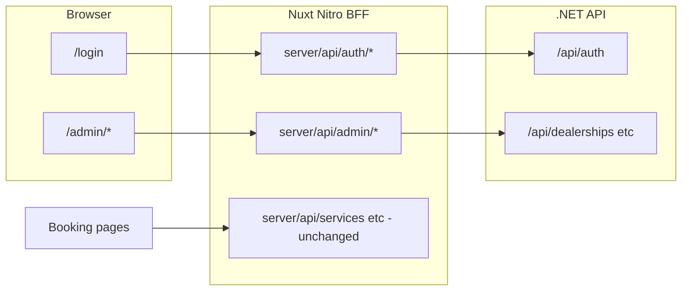

# Frontend–Backend Integration Plan

**Status:** F1 complete — F2 next  
**Last updated:** 2026-07-04  
**Tracker:** [FRONTEND_INTEGRATION_TRACKER.md](./FRONTEND_INTEGRATION_TRACKER.md)  
**Related:** [ARCHITECTURE.md](../ARCHITECTURE.md), [AGENTS.md](../AGENTS.md), [backend IMPLEMENTATION_PLAN.md](../../simple-appointment-scheduler-be/docs/IMPLEMENTATION_PLAN.md)

---

## Scope

Connect the Nuxt frontend to the .NET backend API in two stages:

1. **Login** — JWT auth against `POST /api/auth/login`, session via Pinia + persisted storage
2. **Admin CRUD** — pages to manage all Phase 3 entities (dealerships, skills, service types, bays, technicians, customers, vehicles)

**Out of scope (deferred):** Customer booking flow migration from Nitro mocks to .NET; appointment admin views (blocked on backend Phase 5); register page.

---

## Current state

| Layer | Status |
|-------|--------|
| **Backend** | Phases 1–4 complete — JWT auth, 8 entity CRUD groups, appointment booking |
| **Frontend** | Customer booking flow only — calls local Nitro mocks via `app/composables/useApiClient.ts`; no auth, no admin UI, no `runtimeConfig` |
| **Gap** | No CORS on backend; frontend mock types use `number` IDs vs backend `Guid`; no JWT handling |

---

## Architecture

Use a **Nitro BFF (proxy)** pattern — the browser calls relative `/api/*` on Nuxt; new Nitro routes forward to the .NET API. Existing mock routes for the booking flow stay unchanged until a later phase.



### Auth token flow

1. `POST /api/auth/login` (Nitro) → forwards to `POST {apiBaseUrl}/api/auth/login`
2. Client stores `{ token, expiresAt, email, role }` in Pinia + `useStorage` (localStorage)
3. Authenticated Nitro routes read `Authorization` header from the incoming request and forward to .NET
4. Client calls `GET /api/auth/me` on app init / admin layout mount to load `permissions[]` for nav gating

### API base URL

| Environment | `NUXT_API_BASE_URL` |
|-------------|---------------------|
| Local dev (`dotnet run`) | `http://localhost:52100` |
| Docker Compose (`full` profile) | `http://backend:52100` |

---

## Design decisions

| Topic | Decision |
|-------|----------|
| API integration | Nitro BFF proxy — browser never calls .NET directly; CORS not required |
| Token storage | `useStorage` (localStorage) synced with `authStore` |
| Register page | Deferred — seeded admin only for now (`admin@localhost` per backend user-secrets) |
| Booking flow | Keep Nitro mocks until admin CRUD is complete |
| Admin access | Permission-gated nav from `/api/auth/me`; Staff sees Customers only; Admin sees all |
| ID types | New `app/types/api.ts` uses `string` GUIDs; keep `#server/utils/types` for mocks |
| UI stack | Vuetify forms/tables inside Tailwind layout wrappers (existing convention) |

---

## Backend prerequisite (optional)

CORS is **not blocking** for the BFF approach. Add to `Program.cs` only if calling .NET directly from the browser later:

```csharp
builder.Services.AddCors(options =>
    options.AddDefaultPolicy(p => p
        .WithOrigins("http://localhost:3000")
        .AllowAnyHeader().AllowAnyMethod()));
// ...
app.UseCors();
```

Docker Compose: add `NUXT_API_BASE_URL: http://backend:52100` to the frontend service in `simple-appointment-scheduler-be/docker-compose.yml`.

---

## Phase F1 — Foundation

### Runtime config

Add to `nuxt.config.ts`:

```typescript
runtimeConfig: {
  apiBaseUrl: process.env.NUXT_API_BASE_URL || 'http://localhost:52100',
  public: { appName: 'Universal Scheduler' },
}
```

Add `.env.example` with `NUXT_API_BASE_URL=http://localhost:52100`.

### Shared API types

Create `app/types/api.ts` mirroring backend DTOs (`Infrastructure/*/Dtos/`):

- Auth: `LoginRequest`, `AuthResponse`, `MeResponse`
- Entities: `Dealership`, `Skill`, `ServiceType`, `ServiceBay`, `Technician`, `Customer`, `Vehicle`
- Create/update request types per entity

### Nitro backend client

`server/utils/backendClient.ts`:

- Reads `useRuntimeConfig().apiBaseUrl`
- `backendFetch<T>(path, { method, body, headers })` wrapping `$fetch` to .NET
- Maps `FetchError` to `{ statusCode, message }` for client display

### Auth store & composable

| File | Purpose |
|------|---------|
| `app/stores/authStore.ts` | `token`, `expiresAt`, `email`, `role`, `permissions`; `login`, `logout`, `fetchMe`, `isAuthenticated`, `hasPermission` |
| `app/composables/useAuth.ts` | Thin wrapper for pages/middleware |

### Route middleware

| File | Rule |
|------|------|
| `app/middleware/auth.ts` | Redirect to `/login?redirect=` if not authenticated |
| `app/middleware/admin.ts` | Require `dealerships:read` or `customers:read` permission |

### Nitro auth proxy routes

| Route | Forwards to |
|-------|-------------|
| `server/api/auth/login.post.ts` | `POST /api/auth/login` |
| `server/api/auth/me.get.ts` | `GET /api/auth/me` |

---

## Phase F2 — Login page

| File | Details |
|------|---------|
| `app/pages/login.vue` | Email + password form; error alert for 401; redirect to `?redirect` or `/admin` |
| `app/layouts/default.vue` | Minimal centered layout |
| `app.vue` | Wrap with `<NuxtLayout>` |
| `plugins/auth.client.ts` | On mount: refresh `fetchMe()` if token valid, else clear stale token |

---

## Phase F3 — Admin shell

### Layout & navigation

| File | Details |
|------|---------|
| `app/layouts/admin.vue` | Sidebar + top bar; user email/role; logout |
| `app/pages/admin/index.vue` | Dashboard / overview |

**Nav gated by permission:**

| Nav item | Permission | Role |
|----------|------------|------|
| Dealerships | `dealerships:read` | Admin |
| Skills | `skills:read` | Admin |
| Customers | `customers:read` | Admin, Staff |
| Service Types / Bays / Technicians | `servicetypes:read` etc. | Admin |

All `/admin/**` pages: `definePageMeta({ layout: 'admin', middleware: ['auth', 'admin'] })`.

### Reusable components

| Component | Purpose |
|-----------|---------|
| `app/components/admin/AdminDataTable.vue` | `v-data-table` wrapper — loading, empty state, row actions |
| `app/components/admin/EntityFormDialog.vue` | Create/edit modal with field slot |
| `app/components/admin/ConfirmDeleteDialog.vue` | Delete confirmation |
| `app/components/admin/TimeRangePicker.vue` | `openSecondsFromMidnight` / `closeSecondsFromMidnight` ↔ HH:MM |

### Admin API layer

`app/composables/useAdminApi.ts` — client functions call relative Nitro routes; Nitro proxies to .NET with forwarded `Authorization` header.

```
server/api/admin/
  dealerships/index.get.ts
  dealerships/index.post.ts
  dealerships/[id].put.ts
  skills/index.get.ts
  skills/index.post.ts
  skills/[id].delete.ts
  dealerships/[dealershipId]/service-types/...
  customers/...
  customers/[customerId]/vehicles/...
```

---

## Phase F4 — Entity CRUD pages

Build in dependency order. Each page: list table + create/edit dialog + delete where supported.

### F4a — Skills & Dealerships

| Page | API |
|------|-----|
| `app/pages/admin/skills/index.vue` | `GET/POST /api/skills`, `DELETE /api/skills/{id}` |
| `app/pages/admin/dealerships/index.vue` | `GET/POST/PUT /api/dealerships` |

Dealership form includes `TimeRangePicker` (default 08:00–17:00). Dealership rows link to nested resource pages.

### F4b — Nested under dealership

| Page | Notes |
|------|-------|
| `app/pages/admin/dealerships/[id]/service-types.vue` | Skill dropdown; soft-delete; `isActive` badge |
| `app/pages/admin/dealerships/[id]/service-bays.vue` | Name only; soft-delete |
| `app/pages/admin/dealerships/[id]/technicians.vue` | `skillIds` multi-select |

### F4c — Customers & Vehicles

| Page | Notes |
|------|-------|
| `app/pages/admin/customers/index.vue` | Admin + Staff; row link to vehicles |
| `app/pages/admin/customers/[id]/vehicles.vue` | Hard delete with confirmation |

---

## Phase F5 — Error handling & UX

- Map backend `ProblemDetails` (`title`, `detail`, `status`) to snackbar/alert
- 401 → `authStore.logout()` + redirect `/login`
- 403 → permission denied message
- Loading skeletons; disable submit while saving
- Form validation: required fields, email format, vehicle year range

---

## Phase F6 — Tests & docs

| Area | Tests |
|------|-------|
| `authStore` | Login success/failure, logout, `hasPermission` |
| Login page | Form validation, error display |
| `useAdminApi` / proxy routes | Mock responses; `Authorization` forwarded |
| Middleware | Unauthenticated redirect, permission denial |

Update `ARCHITECTURE.md`, `STORES.md`, and backend `IMPLEMENTATION_PLAN.md` cross-links when phases land.

---

## Deferred

| Item | Notes |
|------|-------|
| Customer booking → .NET | Replace mock `server/api/services`, `availability`, `appointments`; remap `bookingStore` to Guid payloads |
| Appointment admin views | `GET /api/dealerships/{id}/appointments?date=` — needs backend Phase 5 |
| Register page | Low value until role assignment UI exists |

---

## Session deliverables

| Session | Goal |
|---------|------|
| 1 | Login works against live .NET; authenticated user reaches admin shell |
| 2 | Skills + Dealerships CRUD fully working |
| 3 | Nested dealership entities + Customers/Vehicles |

---

## Key files to create

**Frontend:**

- `app/types/api.ts`
- `app/stores/authStore.ts`
- `app/composables/useAuth.ts`, `useAdminApi.ts`
- `app/middleware/auth.ts`, `admin.ts`
- `app/layouts/default.vue`, `admin.vue`
- `app/pages/login.vue`, `app/pages/admin/**`
- `app/components/admin/*`
- `server/utils/backendClient.ts`
- `server/api/auth/*`, `server/api/admin/**`

**Backend (minimal):**

- Optional CORS in `Program.cs`
- `docker-compose.yml` env for `NUXT_API_BASE_URL`
